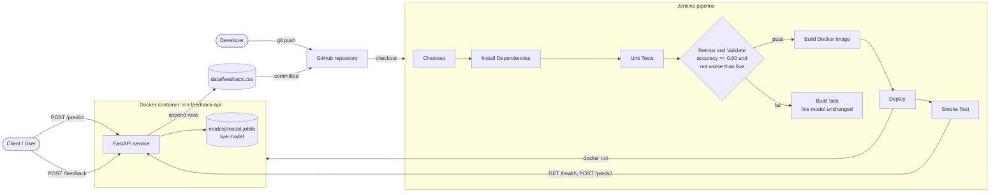

# Smart Feedback System with Auto-Retraining Pipeline

## 1. Introduction

### Problem Statement
Machine-learning models degrade over time as real-world inputs change, and updating a deployed model by hand is slow and risky. A retrained model may be worse than the one already in production, and without automated checks nothing stops it from being deployed.

This project builds an AI DevOps pipeline that collects user feedback on predictions, retrains the model when enough feedback has arrived, validates the new model, and promotes it to production only if it passes quality gates.

### Objectives
- Collect user feedback through a REST API and detect when retraining is needed (threshold: **20 feedback samples**).
- Automate retraining, validation and deployment through a Jenkins CI/CD pipeline with clearly named stages.
- Enforce two quality gates: a minimum validation accuracy of **0.90**, and a candidate that is **not worse than the live model**.
- Package the service as a Docker image and verify every deployment with an automated smoke test.

### Scope and Limitations
**Covered:** feedback collection API, retraining and model promotion with versioning and archiving, unit tests, containerisation (Dockerfile and Docker Compose), Jenkins pipeline with deployment and smoke test, demonstration of a successful run and a rejected run.

**Not covered:**
- Feedback is simulated (`src/simulate_feedback.py`) and stored in a CSV file, not a production database.
- Feedback data reaches Jenkins by being committed to the repository. There is no automatic trigger on the feedback threshold yet; the pipeline is started manually (or by polling, if configured).
- The model is a small Iris classifier used to demonstrate the workflow. Accuracy of a real model would need a larger validation strategy.
- Deployment targets a single local Docker host. There is no orchestration, authentication or monitoring dashboard.

---

## 2. Technologies and Tools

| Category | Tools |
|---|---|
| Languages | Python 3.12 |
| ML libraries | scikit-learn, pandas, joblib |
| API framework | FastAPI, Uvicorn, Pydantic |
| Testing | pytest, FastAPI TestClient (httpx) |
| CI/CD | Jenkins (Pipeline as code, `Jenkinsfile`) |
| Containers | Docker, Docker Compose |
| Source control | Git, GitHub |
| Data store | CSV file (`data/feedback.csv`), mounted as a Docker volume |
| Development | Visual Studio Code, PowerShell, Windows 11 |

**Minimum hardware:** 4 GB RAM (8 GB recommended while Docker Desktop and Jenkins run together), dual-core CPU, 10 GB free disk space. No GPU is required.

---

## 3. System Architecture and Methodology

### System Design



### Methodology
1. Users call `/predict` and, when a prediction is wrong, send the correct label to `/feedback`. The API appends the row to `data/feedback.csv` and reports whether the retraining threshold has been reached.
2. Feedback data is committed to GitHub. Jenkins checks out the repository.
3. Jenkins installs dependencies in a fresh virtual environment and runs the unit tests.
4. **Retrain and Validate:** `src/retrain.py` skips if fewer than 20 samples exist. Otherwise it trains a candidate model on the original Iris training split plus the feedback, and evaluates it on a fixed validation split so models are comparable.
5. **Quality gates:** the candidate must reach at least 0.90 accuracy and must not score lower than the live model. A failure stops the pipeline and the live model is untouched.
6. **Promotion:** the old live model is archived in `models/archive/`, the candidate becomes `models/model.joblib`, and `model_meta.json` records version, accuracy, sample counts and timestamps.
7. Jenkins builds a Docker image tagged with the build number, replaces the running container, and runs the smoke test (`scripts/smoke_test.py`) against `/health`, `/predict` and `/model-info`.
8. On success, the model and its metadata are archived as Jenkins build artifacts.

---

## 4. Implementation Details

### Environment Setup
```powershell
git clone https://github.com/Pranay-blip/ai-devops-feedback-retrain.git
cd ai-devops-feedback-retrain
python -m venv .venv
.venv\Scripts\Activate.ps1
python -m pip install -r requirements.txt

python src/train.py                                   # trains first candidate
Copy-Item models\candidate.joblib models\model.joblib # bootstrap the live model
Copy-Item models\candidate_meta.json models\model_meta.json
```

Run locally:
```powershell
uvicorn src.app:app --reload                          # API docs at http://127.0.0.1:8000/docs
pytest -q                                             # unit tests
python -m src.simulate_feedback --n 25                # generate good feedback
python -m src.simulate_feedback --n 40 --bad          # generate wrong labels (failure demo)
python -m src.retrain                                 # retrain, validate, promote or reject
```

Run in Docker:
```powershell
docker compose up -d --build
curl.exe http://localhost:8000/health
docker compose down
```

### Core Modules

| File | Purpose |
|---|---|
| `src/train.py` | Trains a candidate model, applies the 0.90 quality gate, writes `candidate.joblib` and metadata |
| `src/retrain.py` | Checks the feedback threshold, compares candidate with live model, archives and promotes |
| `src/app.py` | FastAPI service: `/health`, `/predict`, `/feedback`, `/feedback/count`, `/model-info` |
| `src/simulate_feedback.py` | Generates good or deliberately wrong feedback for demonstration |
| `scripts/smoke_test.py` | Post-deployment verification of the running container |
| `tests/` | pytest suite for training, API and retraining logic |
| `Dockerfile`, `.dockerignore` | Build the inference image with the live model baked in |
| `docker-compose.yml` | Runs the service and mounts `data/` so feedback persists |
| `Jenkinsfile` | Seven-stage pipeline: Checkout, Install Dependencies, Unit Tests, Retrain and Validate, Build Docker Image, Deploy, Smoke Test |
| `models/` | Live model, metadata, candidate files and `archive/` of previous versions |

### Challenges Faced

| Challenge | Resolution |
|---|---|
| PowerShell rejected `mkdir src tests models data` | PowerShell needs comma-separated names: `mkdir src, tests, models, data` |
| Retraining wrongly rejected a model with identical accuracy | The candidate's raw accuracy (0.96666…) was compared with the rounded stored value (0.9667). Both are now rounded to 4 decimals before comparing |
| Jenkins could not use Python and Docker when running as the SYSTEM account | Changed the Jenkins Windows service to log on as the local user, then verified with an `env-check` job |
| Candidate and live models must stay comparable after feedback is added | Validation always uses a fixed split of the original dataset; feedback is only added to training data |

---

## 5. Output (Screenshots)

Screenshots are stored in `docs/screenshots/`.

1. Jenkins stage view with all stages green (successful run)
2. Jenkins console output showing `PROMOTED` and `SMOKE TEST PASSED`
3. Jenkins failed run stopped at Retrain and Validate (bad feedback)
4. Running container (`docker ps`) and the API `/docs` page

---

## 6. Observations and Results

### Model Metrics

| Scenario | Training samples | Validation accuracy | Outcome |
|---|---|---|---|
| Initial model | 120 | 0.9667 | Bootstrapped as live model (v1) |
| Retrain with 25 good feedback rows | 145 | 0.9667 | **PROMOTED** v1 to v2 |
| Retrain with 40 wrong-label rows | 160 | 0.9000 | **REJECTED** (worse than live 0.9667) |

### Testing

| Test file | Cases | What is verified |
|---|---|---|
| `tests/test_train.py` | 1 | Training meets the quality gate and writes model files |
| `tests/test_api.py` | 5 | Health, prediction, input validation, feedback storage, invalid label rejection |
| `tests/test_retrain.py` | 1 | Retraining is skipped when feedback is below the threshold |

All 7 tests pass. The pipeline smoke test checks `/health`, a known prediction and `/model-info` on the deployed container.

## 8. References

- Jenkins Pipeline documentation: https://www.jenkins.io/doc/book/pipeline/
- Docker documentation: https://docs.docker.com/
- FastAPI documentation: https://fastapi.tiangolo.com/
- scikit-learn documentation: https://scikit-learn.org/stable/
- pytest documentation: https://docs.pytest.org/